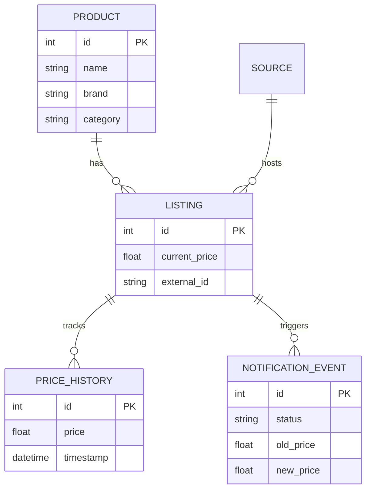
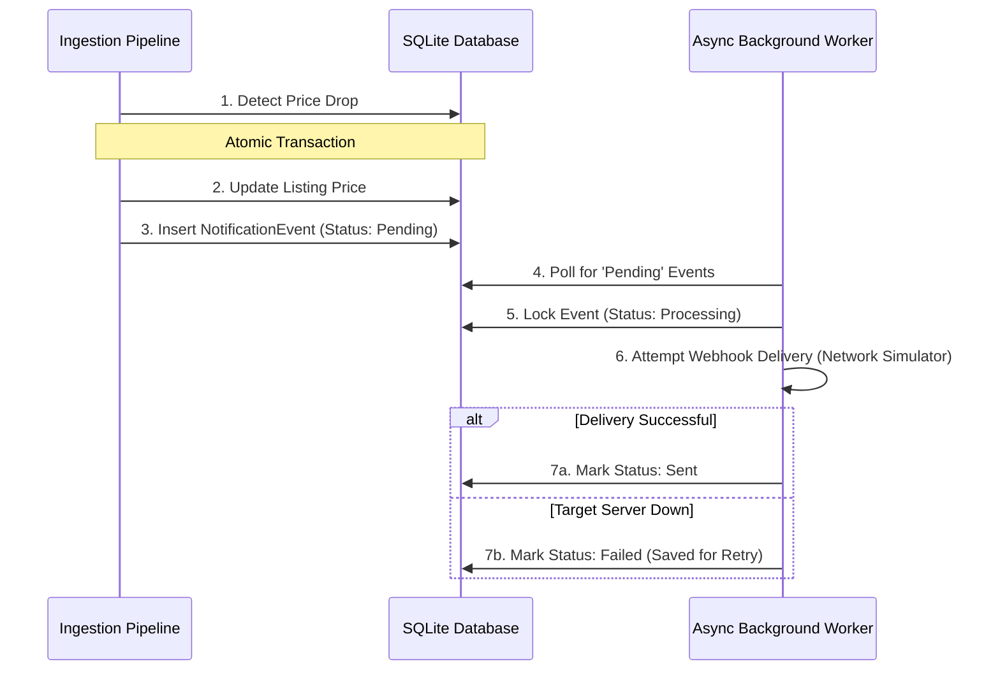

# Price Monitoring System

A lightweight product price monitoring API that ingests marketplace data, stores product listings and price history, detects price changes, and simulates webhook-style notifications.

## What this project contains

- `backend/`: FastAPI service with SQLite persistence and marketplace ingestion logic.
- `backend/app/main.py`: API endpoints for products, analytics, and ingestion.
- `backend/app/ingest.py`: Ingestion pipeline, normalization, price history updates, and notification event processing.
- `backend/app/models.py`: SQLAlchemy models for products, sources, listings, history, and notifications.
- `backend/app/schemas.py`: Pydantic response models for API output.
- `backend/app/database.py`: SQLite engine and session factory.
- `backend/data/`: Sample marketplace JSON data files used by the ingestion pipeline.
- `backend/tests/`: Pytest coverage for API behavior.

## How to run it

### 1. Open a terminal in the repository root

```powershell
cd C:\Users\HP\price-monitoring-system
```

### 2. Activate the virtual environment

This repository uses `venv/` for its environment dependencies. 

**Windows (PowerShell):**
```powershell
.\venv\Scripts\Activate.ps1
```

**Mac/Linux:**
```bash
source venv/bin/activate
```

### 3. Install dependencies

```powershell
pip install -r backend/requirements.txt
```

### 4. Start the API server

From the `backend/` directory after activation:

```powershell
cd backend
uvicorn app.main:app --reload
```

### 5. Open the API docs

Once the server is running, visit:

- `http://127.0.0.1:8000/docs`
- `http://127.0.0.1:8000/redoc`

### 6. Open index.html in the frontend folder
-Run with live server to open the website interface

## API documentation

### Authentication

All protected endpoints require the header:

```http
X-API-Key: entrupy-intern-2026
```

### Endpoints

#### `GET /`

Returns a health message.

Example response:

```json
{
  "message": "Price Monitoring System Running. Check /docs for API documentation."
}
```

#### `POST /ingest/`

Triggers a manual ingestion pipeline run.

Example response:

```json
{
  "message": "Async data ingestion pipeline executed successfully"
}
```

#### `GET /products/`

Returns all products with listings and price history.

Query parameters:

- `category` — filter by product category
- `min_price` — filter by minimum current price
- `max_price` — filter by maximum current price

Example request:

```http
GET /products/?category=Accessories&min_price=100&max_price=500
X-API-Key: entrupy-intern-2026
```

Example response shape:

```json
[
  {
    "id": 1,
    "name": "Chanel Belt",
    "brand": "Chanel",
    "category": "Accessories",
    "listings": [
      {
        "id": 12,
        "external_id": "https://example.com/listing/123",
        "url": "https://example.com/listing/123",
        "current_price": 450.0,
        "currency": "USD",
        "last_seen": "2026-04-02T12:34:56",
        "price_history": [
          { "price": 470.0, "timestamp": "2026-03-15T10:00:00" },
          { "price": 450.0, "timestamp": "2026-04-02T12:34:56" }
        ]
      }
    ]
  }
]
```

#### `GET /products/{product_id}`

Get a single product with all listings and price history.

Example request:

```http
GET /products/1
X-API-Key: entrupy-intern-2026
```

Example response shape:

```json
{
  "id": 1,
  "name": "Chanel Belt",
  "brand": "Chanel",
  "category": "Accessories",
  "listings": [ ... ]
}
```

#### `GET /analytics/`

Returns aggregate analytics.

Example response shape:

```json
{
  "total_products": 42,
  "listings_by_source": [
    { "source_name": "fashionphile", "total_listings": 24 },
    { "source_name": "1stdibs", "total_listings": 18 }
  ],
  "averages_by_category": [
    { "category": "Accessories", "average_price": 329.55 }
  ]
}
```

## Design decisions

### Price history storage

Price history is stored in a separate `price_history` table and linked to `listings`.

- This keeps each listing row compact while preserving every price update.
- The table uses indexed foreign keys and timestamps for faster retrieval.
- On large scale, this design can be extended into a proper time-series store or partitioned history table.

#### What happens at millions of rows?

Current implementation uses SQLite, which is fine for development but not ideal at scale.

At millions of rows, the next steps would be:

- move to Postgres or another relational database with stronger write concurrency
- add indexes on `(listing_id, timestamp)` and `(source_id, current_price)`
- use batching and bulk inserts for history updates
- optionally separate hot/current listing state from cold history storage
- consider a dedicated time-series engine for very high-volume price telemetry

### Notification implementation

Price change notification is implemented through a persistent `NotificationEvent` queue.

- `process_and_store_data()` detects changes and creates `NotificationEvent` rows with `status = pending`.
- `process_notifications()` reads pending events, simulates webhook delivery, and updates event state.

Why this approach?

- decouples ingestion from delivery
- avoids blocking ingestion while a webhook is sent
- preserves failed events for retry and debugging
- is easier to extend to real async notification systems later

Alternative approaches would include sending webhook requests immediately while ingesting. That is simpler, but it is more fragile because failures would directly affect the ingestion path and the system would have no persistent retry queue.

### Extending to 100+ data sources

The ingestion design already supports dynamic sources via the `Source` table and source-specific discovery.

To extend cleanly:

- convert each source into its own ingestion adapter/service
- keep a source registry instead of hard-coded names
- support external API calls instead of local JSON files
- use a queue or scheduler to control fetch cadence for many sources
- shard ingestion across workers so no single process blocks on all sources
- normalize marketplace payloads through a shared transformation layer

### Database Schema


### Asynchronous Notification Flow

## Known limitations

### Current limits

- SQLite only, so concurrency and scale are limited.
- Data ingestion is based on local JSON files, not real marketplace APIs.
- No pagination or sorting support on `GET /products/`.
- Authentication is a single static API key, not a full user or role system.
- Notification delivery is simulated via logs rather than real HTTP/webhook deliveries.
- No durable retry strategy for webhook failures beyond simple status tracking.

### Improvements with more time

If time allowed, I would improve the system by:

- replacing SQLite with PostgreSQL
- implementing a source adapter layer for real marketplace APIs
- adding scheduled ingestion and source-specific polling intervals
- building real webhook delivery with retries, backoff, and dead-letter processing
- adding pagination, filtering, and sorting for product listings
- introducing observability: metrics, tracing, and request logging
- adding real authentication and authorization

## Running tests

From the project root:

```powershell
.\.venv\Scripts\python.exe -m pytest backend/tests
```

### Test Coverage (10/10 Passing)

The backend includes a comprehensive Pytest suite using an in-memory SQLite `StaticPool` to ensure isolated, repeatable testing. The suite validates:

**Authentication & Security**
* `test_valid_api_key_and_usage_tracking`: Ensures valid keys are accepted and usage metrics increment correctly.
* `test_invalid_api_key_rejected`: Verifies missing or incorrect keys return a `401 Unauthorized`.

**Ingestion & Database Logic**
* `test_no_duplicate_history_on_same_price`: Prevents database bloat by ensuring identical prices don't create duplicate history rows.
* `test_price_change_creates_history_and_notification`: Validates that a detected price drop successfully creates a new chronological history record and queues a webhook event.
* `test_product_deduplication`: Ensures items scraped from different sources with the same normalized key map to the same base product.

**Webhook Notifications (Outbox Pattern)**
* `test_notification_delivery_failure_handling`: Simulates a network timeout and ensures failed webhooks are safely logged as `failed` rather than losing the event data.

**API Endpoints & Analytics**
* `test_get_products_includes_chronological_history`: Seeds the database and verifies that nested relationships (Products -> Listings -> History) serialize correctly and chronologically.
* `test_trigger_refresh_endpoint`: Validates that the `POST /ingest/` endpoint successfully triggers the asynchronous background pipeline.
* `test_analytics_aggregations`: Ensures the `GET /analytics/` endpoint accurately calculates total listings by source and average prices by category.
* `test_input_validation`: Ensures the API correctly handles malformed requests and validates data types using Pydantic schemas.

## Notes

- The current server entrypoint is `backend.app.main:app`.
- The API is designed to be easy to extend, with ingestion separated from data storage and notification handling.
- Use `/docs` after startup to explore models and example requests interactively.


